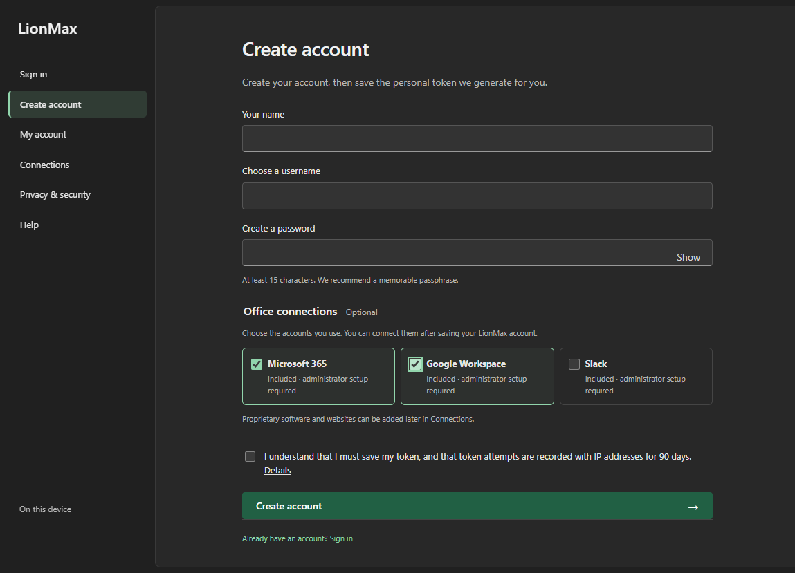

# LionMax Universal Logon



[Download LionMax Desktop 0.2.0 for Windows](https://github.com/ghostventure/Black-Lion-Express-Module-library/releases/tag/lionmax-v0.2.0)

LionMax is a standalone identity service. A user signs in with a username, password and personal seven-character alphanumeric token. After five failed attempts the account locks for 15 minutes; the counter and lock persist through a restart. Token verification records the observed IP, time and outcome. The account screen groups attempts by exact IP for the last 90 days.

Another application can integrate LionMax through OpenID Connect Authorization Code with PKCE. The included Northstar app runs at a separate origin and demonstrates the whole flow. Client apps never receive the LionMax password or personal token. External software must choose to integrate LionMax; it cannot automatically authenticate unrelated applications.

## Run on Windows

The account setup page includes Microsoft 365, Google Workspace and Slack identity connectors. Selections, verified linked accounts and saved proprietary website links persist in the user database. **Connections** shows whether a provider needs configuration, is ready, or has been linked. Custom OpenID Connect providers can be added through local configuration; proprietary software can also use LionMax as its OIDC sign-in provider. See [connector setup](docs/CONNECTORS.md). Provider registration and credentials are required before live connections work; saved website links alone do not enable single sign-on.

The standalone desktop build opens in its own LionMax window and does not require Edge or another browser. Run `npm run build:desktop` to create `release/desktop/LionMax-win32-x64/LionMax.exe`. Keep the complete output folder together when copying it. Node and the desktop runtime are bundled, so local sign-in works without Internet access. Existing accounts remain in `%LOCALAPPDATA%\LionMax\data`. Closing the desktop program stops services it started; services already running before launch are left running.

The older ZIP described below uses the browser launcher.

For the older 0.1.0 release, download and extract its Windows ZIP, then open **LionMax Universal Logon.exe** or **Start LionMax.cmd**. LionMax opens at `http://127.0.0.1:4545/login`. The separate Northstar demo runs at `http://127.0.0.1:4546`. Use **Stop LionMax.cmd** to stop instances started by the launcher. The ZIP includes Node and its dependencies. Keep the folder intact when moving it.

Accounts, sessions, signing keys and audit data live under `%LOCALAPPDATA%\LionMax\data`, separate from the application files, so a new version does not erase the database. The launcher writes diagnostics under `%LOCALAPPDATA%\LionMax`. The token appears once when an account is created or replaced; save it in a password manager. This release has no self-service recovery if both the token and its copy are lost. Do not create important accounts until an operator has a verified recovery procedure.

## Develop and verify

Node 24 or newer is required. In this directory, run `npm ci`, `npm start`, and in another terminal `npm run demo`. Run `npm test` and `npm run test:browser` for the core and real-browser tests. The latter uses Microsoft Edge, writes screenshots to `artifacts/`, and creates a disposable database. `npm run backup` makes a consistent SQLite backup plus a copy of the signing key; store the entire backup privately. Restore both files together while LionMax is stopped.

The repository does not contain credentials or account data. `.gitignore` excludes local databases, signing keys, logs and screenshot artifacts. Passwords and personal tokens use separate Argon2id hashes. One-time authorization codes, sessions, grants and client registrations are persisted in SQLite. The application presents a generic failure after incorrect credentials, and throttles requests from each observed IP as well as locking the account.

## Connect another application

The registered operator runs:

```powershell
npm run client:add -- example-app "Example App" https://app.example.com/auth/callback
```

Restart LionMax after adding a client. Only exact HTTPS callbacks, or HTTP callbacks on the application's loopback host, are accepted. The OIDC discovery document is `http://127.0.0.1:4545/.well-known/openid-configuration` for local development. Clients use `openid profile`, Authorization Code, PKCE S256, `state` and `nonce`. They must validate the ID token signature, issuer, audience, expiration and nonce, then retrieve optional profile claims from the UserInfo endpoint. No client secret is issued to public clients.

The Northstar demo in `examples/demo-app.js` shows the integration in code. Every new authorization asks for LionMax credentials, including the token. The demo is a local example, with its own short-lived in-memory session, and is not a general hosted application.

## Production boundary

This build is verified as a local prototype. A real Internet-facing identity service needs a stable HTTPS domain, TLS termination, secure reverse-proxy configuration, monitored encrypted backups, account recovery, a privacy/contact policy, operational monitoring, and an independent security review. Set `NODE_ENV=production`, `LIONMAX_ISSUER=https://your-domain`, `LIONMAX_BIND` and `LIONMAX_TRUST_PROXY` for that environment, and register the actual callback URLs. The local launcher is for loopback use. Never put the SQLite database or signing keys on a public web root.

The seven-character code is reusable and can be phished or copied. It is an additional secret, not phishing-resistant multifactor authentication. Five-attempt lockout and connection throttling reduce online guessing; they do not protect a stolen password and token together. IP addresses identify connections, not exact physical locations; proxies and shared networks can make several users appear under one IP.
